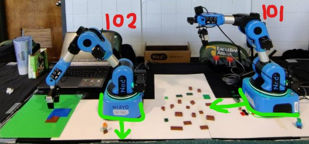

# Multi-Robot Lego Assembly Documentation
This document should serve as a good starter guide with all the links and information necessary to understand and get set up with the system for it work smoothly.

## Version, Env, Dependencies
    Python Version: 3.10 and above
    Dependencies:   requirements.txt

## Understandin Directories
```
In this Github, you will find 2 directories:
        Final Implementation:
            This is the final iteration of our setup, which is in the Cam_setup directory.
    
            You will first have to create an python env with the requirement.txt file and run the main.py to execute.
            Assuming that you have the robots in their desired locations and connected to the iperlab router. This will be explained in detail
    
            The runs directory contains the checkpoints of our trained YOLO models from our first iteration.
    
        Gemini integration: 
            This directory contains the files of the failed iteration with VLM.
            Of the files the gemini.py file is the VLM implementation, the other files involved are trying to read form the json file that comes out of the gemini.py file to then run the robots. 
            But this was scrapped as the API failed in getting accurate values. 
    
        IF you want to try out any of our previous implementations here is a link to a google drive:
            https://drive.google.com/drive/folders/1l53dQ7XxlGnE1Ck7UV8uKxWXS6jhsTwl?usp=sharing
```


## Documentations for software Dependecies used
Niryo Studio:   to read the positional arguments and move the arm in real time\
    https://niryo.com/niryostudio/    \
Niryo Robot Wrapper: \
    https://niryorobotics.github.io/pyniryo/v1.2.0-1/index.html   \
YOLO:\
    https://github.com/ultralytics/ultralytics  \
Roboflow, labeling any new images you will take:  \
    https://app.roboflow.com/imgs   \
Gemini-API:          \
    https://ai.google.dev/gemini-api/docs    \
Studio2.0-LegoCAD:    Use this to generate the LDR file for reading the instructions\
    https://www.bricklink.com/v3/studio/download.page
       
  
## Current Setup


**NOTE:** You should find the position markings on the table itself, if you get confused by the markings since there are multiple, there should be a set of papers connected by masking tape lying around somewhere in the lab that we used for an event, which is the exact one used in the image above. 

This current setup involves, using 2 arms the 102 for movement and 101 for computer vision
Before you continue, make sure these are positioned exactly with in the boxes of the table as shown in the image with 102 facing towad you and 101 facing toward the workspace. \

Also You will need to connect both the robots to the router available in the lab via ethernet, and you may also connect your computer via ether net to the router or simply connect to the iperlab router wifi to interact with the robots. 

## Running the program

Once you have your python env setup, that is hopefully you have already run the:
```
    pip install -r requirements.txt
```
you should have everything you need to run the final implementation, but this requirements.txt doesnt cover the gemini.py file.
hence, if you are trying to run the gemini.py, you may run into some module not found errors, and 
```
    pip install python-gemini-api
```
might be necessary **along with creating an account with GeminiAPI in order to get the API key for the program.** 

Now that you have downloaded sucessfully 
simply running
```
    python main.py
```
inside the Cam_setup directory should go through and run the program, provided the robot connection setup is accurate and positioned exactly where it is supposed to be. 

## How The Program in Final Implementation Runs
One thing to note,\
    Everytime you call the movement function for any arm, the entire process stops until the arm has been moved to that position
### Main.py
Runs through all the initializations, as in intialize the robots, and the motors, with generating and reading the instructions form the ldr file for the lego instrucitons and finally iniialize the SharedData whcih stores the state variables for the machines. After which it starts the multithreading for the movment arm 102, and camera arm 101.
While initializing the sharedData, a call to the assemble.py file's set pick obj is done. Where the index is set to the class number of the next object to be picked read from the ldr file. 

### Niryo_Vision.py
Once the initializations sequnece is setup the execution moves to the niryo_vision.py file, where you are introduced to the vision(ned2,share) function. Here ned2 will be 101 arm which was initialized in the main.py file, 
and you are also introduced to the 
    share.update; this is the state variable that ensures that the camera captures when the arm is done moving and no multithreading issues occur.
Then in the loop, it sends the images captured through the fisheye lens, undistorts them and sends the image to the YOLO world model. 
the resulting list of objects is sent to the distance.py file. Which will return the singular xm,ym of the object of interest. 
Then the shareData's xm and ym values are changed to include that values for nextpose pick piece. 
And switched the setUpdate(1), saying that we are ready for pick. 

### Distance.py
In the Distance.py file the only function of interest here is the find shortest. 
which takes in the list of objects seen from the YOLO WORLD in niryo vision, and then checks for the objindex that is generated from main.py and assemble.py, and then returns the xm,ym(midpoints of the object location) to the sharedData, for the pick to continue working.  

### Main.py; call_movment_when_ready
This part should have been in a differnt file but didnt get to it. 
This funciton is triggered when The update is set to 1, multithreading will be infinitely running this function in the background until update is set to 1; saying that that next position is know and the movment arm can move. Which calls the pick.py next_pose function which takes in the share.xm and share.ym, the objects that were changed in the Distance.py file. The pick.py will then return the 6 axis coordinates for where the arm should go and pick things up. Once the Pick movment is complete the state variable Grab is set to 1, which signifies that the assembly can commence. 

### pick.py
In this we are making use of helper funciton to use a homography of the x, y camera coordinates to them map them to the real world coordinates. In this program, next_pos() function is the one we are interested in, where it takes the xm, ym, from the share.xm, share.ym that is passed through and then changes the position from the share.nextPose object in the SharedData. 

### assemble.py
Now that pick is complete Grab will be set to 1, triggereing the assembly code. where assembly() is the function we are using, which makes use of a herlper function ass_xyz() which reads through the lego_instructions in sharedData and returns the xyz location of the pice to then proceede with the set of assembly maneuvers for placement. Finally set Grab to 2, which Goes back over to pick where it resets the arm positions to observation pose(default position) where share.Grab and share.Update gets set to 0 and then increments to next instruction to then continue the processing. 

-----------------------------------------------------------------------------